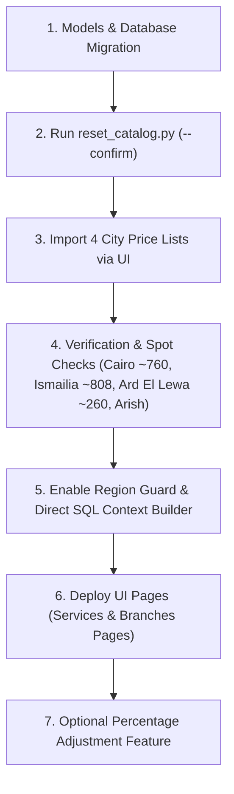

# 🗺️ Master Implementation Plan: Regions/Zones, PDF Extraction & UI Excel Import

> This document is the revised, authoritative implementation plan for catalog reset, 4-city pricing, UI Excel import, deterministic PDF extraction, and zone-aware bot routing.

---

## 🚀 Strict Deployment Sequence

To prevent bot downtime or "service unavailable in your region" errors for existing clients, execution **must** follow this strict order:



---

## 🏗️ Simplified Architecture & Direct Context Flow

```mermaid
flowchart TD
    A["4 City Price Lists (.xlsx/.csv or PDF)"] -->|1. Import via UI Modal| B["price_import_service.py"]
    B -->|2. Match by normalized English name| C[("DB: LabService & ServicePrice")]
    B -->|3. Batch Embed New Tests| D["Gemini Embeddings"]
    D -->|4. Vector Upsert (No Price)| E[("Qdrant Vector DB (test_id, name, keywords)")]
    F["Client Message"] -->|5. Needs Price/Booking?| G{"Region Guard Node"}
    G -->|No| H["Process Inquiry / Complaint Directly"]
    G -->|Yes, Missing City| I["Ask Client for Region"]
    G -->|Yes, City Set| J["LangGraph Router"]
    J -->|Pass state.city_id & Query| K["search/context_builder.py"]
    K -->|Semantic Query| L[("Qdrant Search")]
    K -->|SQL Query (ServicePrice + City)| M[("DB: service_prices")]
    K -->|Formats City Price or Alternate Cities| N["Rich RAG Context"]
    N --> O["LLM Single-Pass Response (Fast & Accurate)"]
```

---

## Phase 0 — Catalog Reset Tool

### New Files to Create

| File | Purpose |
| :--- | :--- |
| [`tools/reset_catalog.py`](file:///c:/Users/menna/Desktop/el%20sadara_agent/tools/reset_catalog.py) | **Destructive, safe catalog reset CLI script:**<br>- **Default Dry Run:** Prints row counts to be deleted from `service_prices`, `lab_services`, and Qdrant points. Executes changes ONLY when run with `--confirm`.<br>- **Backup:** Creates a timestamped database dump/backup file before deletion and prints its absolute path.<br>- **Lab Scoped:** Scopes all operations to the specified `--laboratory-id` (default `1`). Inspects foreign keys pointing to `lab_services` and reports them before deleting.<br>- **Qdrant Reset:** Wipes old Qdrant vectors for the lab and recreates an empty collection.<br>- **Seed 4 Cities:** Seeds `City` records (*القاهرة, الإسماعيلية, العريش, أرض اللواء*) with `sort_order` and `aliases`. Creates **NO** branches automatically.<br>- **Safe Boundaries:** Idempotent. NEVER touches `clients`, `bookings`, `inquiries`, `complaints`, `subscriptions`, or `pages`. |

---

## Phase 1 — Database Models & Schema

### 1.1 New Files to Create

| File | Purpose |
| :--- | :--- |
| [`migrations/versions/xxxx_add_cities_branches_prices.py`](file:///c:/Users/menna/Desktop/el%20sadara_agent/migrations/versions) | Alembic migration: Create `cities`, `branches`, `service_prices` tables; add `city_id` FK to `clients`; widen `lab_services.name` to `String(255)`; make `lab_services.price` `nullable=True`. |

### 1.2 Files to Modify

| File | What Changes |
| :--- | :--- |
| [`models/models.py`](file:///c:/Users/menna/Desktop/el%20sadara_agent/models/models.py) | **Add Models:**<br>- **`City`:** `id`, `laboratory_id`, `name`, `aliases` (JSON), `sort_order`. `UniqueConstraint('laboratory_id', 'name')`. Deletion guard: cannot delete if referenced by branches, prices, or clients.<br>- **`Branch`:** `id`, `city_id`, `name`, `address`, `working_hours`.<br>- **`ServicePrice`:** `id`, `service_id` (FK `lab_services.id`), `city_id` (FK `cities.id`), `price`, `is_available`. `UniqueConstraint('service_id', 'city_id')`.<br>**Modify `LabService`:** Widen `name` to `String(255)`, make `price` `nullable=True` (unused, scheduled for future cleanup migration), add `prices` relationship.<br>**Modify `Client`:** Add `city_id = db.Column(db.Integer, db.ForeignKey('cities.id'), nullable=True)`.<br>**Modify `Laboratory`:** Add `cities` relationship. |

---

## Phase 2 — PDF/Excel Import Engine & Rules

### 2.1 New Files to Create

| File | Purpose |
| :--- | :--- |
| [`tools/extract_pdf_prices.py`](file:///c:/Users/menna/Desktop/el%20sadara_agent/tools/extract_pdf_prices.py) | **Deterministic PDF Extractor:** Primary path is Excel upload (`.xlsx`/`.csv`). For PDFs, uses deterministic `pdfplumber`/regex (**NO LLM / NO Gemini**).<br>- **Validation:** Verifies parsed row count equals the last Serial number in the file, and all prices parse as numbers. Fails loudly with offending rows on mismatch.<br>- **Output Columns:** `Test Name`, `Price`, `Test Details` (becomes description for new tests; no Category column).<br>- **Arish PDF:** Fails with explicit error if layout differs from expected schema. |
| [`services/domain/price_import_service.py`](file:///c:/Users/menna/Desktop/el%20sadara_agent/services/domain/price_import_service.py) | **Import Engine & Business Rules:**<br>- **Name Matching:** Normalizes English test names (`strip()`, collapse whitespace, case-insensitive). Arabic normalization is NOT used for test names.<br>- **Zero/Empty Price:** Skips row and logs under "needs review". Never creates a `ServicePrice` record.<br>- **Duplicates in File:** Last row wins, logs warning.<br>- **Missing Prices:** Never deletes existing prices unless admin explicitly checks `"delete prices not in file"` (default `False`).<br>- **Performance:** Loads all existing test names into an in-memory dict once (O(1) lookups; imports 2000+ rows in seconds).<br>- **Caching:** `preview` and `commit` share parsed rows via server-side temp storage or session token so file is uploaded once.<br>- **Transaction & Vector Batching:** `commit` executes in a single DB transaction. Vector embedding & Qdrant upserts for new tests run in background/batches to prevent HTTP timeouts.<br>- **Multi-City Progression:** First city import creates `LabService` rows; subsequent city imports match by name and insert `ServicePrice` rows. |
| [`services/domain/price_export_service.py`](file:///c:/Users/menna/Desktop/el%20sadara_agent/services/domain/price_export_service.py) | Export engine: Exports tests and prices for a city to Excel via Flask `send_file`. |
| [`routes/price_routes.py`](file:///c:/Users/menna/Desktop/el%20sadara_agent/routes/price_routes.py) | Blueprint `price_bp`: `POST /prices/import/preview`, `POST /prices/import/commit`, `GET /prices/export`. |
| [`utils/arabic_normalize.py`](file:///c:/Users/menna/Desktop/el%20sadara_agent/utils/arabic_normalize.py) | Utility: `normalize_arabic(text)` used exclusively for matching client chat responses when selecting their region. |

### 2.2 Files to Modify

| File | What Changes |
| :--- | :--- |
| [`app.py`](file:///c:/Users/menna/Desktop/el%20sadara_agent/app.py) | Register `price_bp` blueprint. |
| [`templates/test/test_service.html`](file:///c:/Users/menna/Desktop/el%20sadara_agent/templates/test/test_service.html) | Add **"استيراد أسعار"** button and 3-step import modal (Upload file -> Preview summary -> Confirm import). |
| [`static/js/test_service.js`](file:///c:/Users/menna/Desktop/el%20sadara_agent/static/js/test_service.js) | Modal JS: Uploads file once for preview, triggers commit AJAX. |
| [`static/css/style.css`](file:///c:/Users/menna/Desktop/el%20sadara_agent/static/css/style.css) | Modal styling and diff counters. |

---

## Phase 3 — Bot: Selective Region Guard & Direct SQL Context Builder

### 3.1 New Files to Create

| File | Purpose |
| :--- | :--- |
| [`graph/nodes/region_guard_node.py`](file:///c:/Users/menna/Desktop/el%20sadara_agent/graph/nodes/region_guard_node.py) | **Selective Region Guard:**<br>- Triggers ONLY when intent requires region-specific data (Pricing, Booking, Branch Location/Hours).<br>- Complaints and general inquiries bypass the guard.<br>- If `client.city_id` is missing, prompts patient to choose their city (*القاهرة, الإسماعيلية, العريش, أرض اللواء*), saves selection, and executes `pending_question` replay. |

*(Note: `price_tool.py` has been eliminated to keep the architecture single-pass, fast, and deterministic without LLM Tool Calling)*

### 3.2 Files to Modify

| File | What Changes |
| :--- | :--- |
| [`search/context_builder.py`](file:///c:/Users/menna/Desktop/el%20sadara_agent/search/context_builder.py) | **Direct SQL+Qdrant Integration:**<br>- Receives `city_id` from `AgentState`.<br>- For each retrieved test from Qdrant, queries `ServicePrice` for `city_id`.<br>- If price exists: formats `اسم التحليل: X - السعر في [المنطقة]: Y ج.م`.<br>- If unavailable in target city: queries available cities and formats `غير متاح في [المنطقة] (متاح في: القاهرة، الإسماعيلية)`. |
| [`graph/state.py`](file:///c:/Users/menna/Desktop/el%20sadara_agent/graph/state.py) | Add `city_id`, `city_name`, `pending_question`, `region_asked` to `AgentState`. |
| [`graph/graph.py`](file:///c:/Users/menna/Desktop/el%20sadara_agent/graph/graph.py) | Wire `region_guard_node` after intent detection. |
| [`graph/nodes/inquiry_node.py`](file:///c:/Users/menna/Desktop/el%20sadara_agent/graph/nodes/inquiry_node.py) & [`booking_node.py`](file:///c:/Users/menna/Desktop/el%20sadara_agent/graph/nodes/booking_node.py) | Pass `city_id` into `context_builder.py`. |
| [`graph/prompts/inquiry_prompt.py`](file:///c:/Users/menna/Desktop/el%20sadara_agent/graph/prompts/inquiry_prompt.py) & [`booking_prompt.py`](file:///c:/Users/menna/Desktop/el%20sadara_agent/graph/prompts/booking_prompt.py) | Direct LLM to use prices directly from the retrieved context text. |
| [`services/shared/vector_service.py`](file:///c:/Users/menna/Desktop/el%20sadara_agent/services/shared/vector_service.py) | Ensure vector payload contains `test_id`, `name`, `description`, `keywords` **without price**. Recreate collection helper for `reset_catalog.py`. |
| [`services/messaging/client_service.py`](file:///c:/Users/menna/Desktop/el%20sadara_agent/services/messaging/client_service.py) | Add `update_city(city_id)` and `get_city_id()` helper methods to manage client's selected zone. |

---

## Phase 4 — Services Page UI: Zone Pills & Forms

| File | What Changes |
| :--- | :--- |
| [`routes/test_routes.py`](file:///c:/Users/menna/Desktop/el%20sadara_agent/routes/test_routes.py) | Accept `city_id` filter; pass cities list and selected zone to template. |
| [`services/domain/tests_service.py`](file:///c:/Users/menna/Desktop/el%20sadara_agent/services/domain/tests_service.py) | Join `ServicePrice` and filter by active `city_id`. |
| [`templates/test/test_service.html`](file:///c:/Users/menna/Desktop/el%20sadara_agent/templates/test/test_service.html) | Add **Zone Pill buttons** (*الكل | القاهرة | الإسماعيلية | العريش | أرض اللواء*). Render active zone price. |
| [`templates/test/test_form.html`](file:///c:/Users/menna/Desktop/el%20sadara_agent/templates/test/test_form.html) | Form section for per-zone price inputs. |

---

## Phase 5 — Zone & Branch Dashboard UI

| File | What Changes |
| :--- | :--- |
| [`routes/city_routes.py`](file:///c:/Users/menna/Desktop/el%20sadara_agent/routes/city_routes.py) & [`branch_routes.py`](file:///c:/Users/menna/Desktop/el%20sadara_agent/routes/branch_routes.py) | **(New)** CRUD routes for `City` and `Branch` entities. |
| [`services/domain/city_service.py`](file:///c:/Users/menna/Desktop/el%20sadara_agent/services/domain/city_service.py) & [`branch_service.py`](file:///c:/Users/menna/Desktop/el%20sadara_agent/services/domain/branch_service.py) | **(New)** Business logic for zones and branches. |
| [`templates/laboratory/list.html`](file:///c:/Users/menna/Desktop/el%20sadara_agent/templates/laboratory/list.html) | Redesign page into **Zone Cards** (*القاهرة, الإسماعيلية, العريش, أرض اللواء*) with branch lists and branch creation modal. |
| [`templates/base.html`](file:///c:/Users/menna/Desktop/el%20sadara_agent/templates/base.html) | Rename sidebar item "إدارة المعامل" -> "إدارة المعامل والفروع" to reflect updated scope. |

---

## Phase 6 — Bulk Price Percentage Adjustment (Optional)

| File | What Changes |
| :--- | :--- |
| [`routes/price_routes.py`](file:///c:/Users/menna/Desktop/el%20sadara_agent/routes/price_routes.py) | Add `POST /prices/adjust` endpoint (`city_id`, `percentage`). |
| [`services/domain/price_import_service.py`](file:///c:/Users/menna/Desktop/el%20sadara_agent/services/domain/price_import_service.py) | Add `adjust_prices(city_id, percentage)` function. |

---

## 🧪 Comprehensive Test Suite

| Test File | Purpose |
| :--- | :--- |
| [`tests/test_import.py`](file:///c:/Users/menna/Desktop/el%20sadara_agent/tests/test_import.py) | **(New)** Test PDF deterministic validation, Excel parsing, name matching, zero price skipping, duplicate override, single transaction commit, and Qdrant batching. |
| [`tests/test_price_tool.py`](file:///c:/Users/menna/Desktop/el%20sadara_agent/tests/test_price_tool.py) | **(New)** Test `get_test_price` with state-injected `city_id`, missing city fallback, and `available_cities` response payload. |
| [`tests/test_region_guard.py`](file:///c:/Users/menna/Desktop/el%20sadara_agent/tests/test_region_guard.py) | **(New)** Test selective region guard triggering (bypass for complaints, trigger for price/booking), Arabic normalization, and pending question replay. |
| [`tests/test_tenant_isolation.py`](file:///c:/Users/menna/Desktop/el%20sadara_agent/tests/test_tenant_isolation.py) | **(New)** Test tenant isolation across city, branch, and price import endpoints. |

---

## 📊 Summary of File Modifications

### New Files (17)
- `migrations/versions/xxxx_add_cities_branches_prices.py`
- `tools/extract_pdf_prices.py`
- `tools/reset_catalog.py`
- `graph/nodes/region_guard_node.py`
- `graph/tools/price_tool.py`
- `utils/arabic_normalize.py`
- `services/domain/price_import_service.py`
- `services/domain/price_export_service.py`
- `services/domain/city_service.py`
- `services/domain/branch_service.py`
- `routes/price_routes.py`
- `routes/city_routes.py`
- `routes/branch_routes.py`
- `tests/test_import.py`
- `tests/test_price_tool.py`
- `tests/test_region_guard.py`
- `tests/test_tenant_isolation.py`

### Modified Files (21)
- `models/models.py`
- `app.py`
- `graph/state.py`
- `graph/graph.py`
- `graph/nodes/inquiry_node.py`
- `graph/nodes/booking_node.py`
- `graph/prompts/inquiry_prompt.py`
- `graph/prompts/booking_prompt.py`
- `search/context_builder.py`
- `services/shared/vector_service.py`
- `services/messaging/client_service.py`
- `services/domain/tests_service.py`
- `services/domain/laboratory_service.py`
- `routes/test_routes.py`
- `routes/laboratory_routes.py`
- `templates/base.html`
- `templates/test/test_service.html`
- `templates/test/test_form.html`
- `templates/laboratory/list.html`
- `static/css/style.css`
- `static/js/test_service.js`
